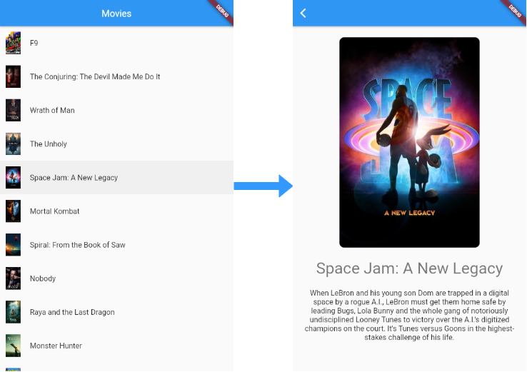
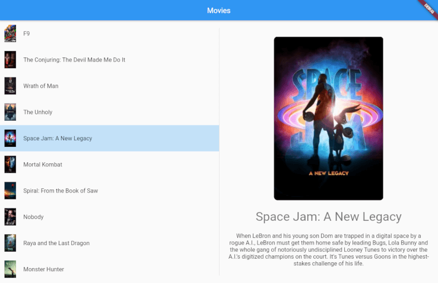
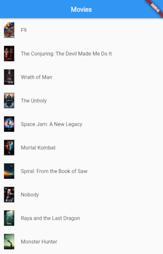
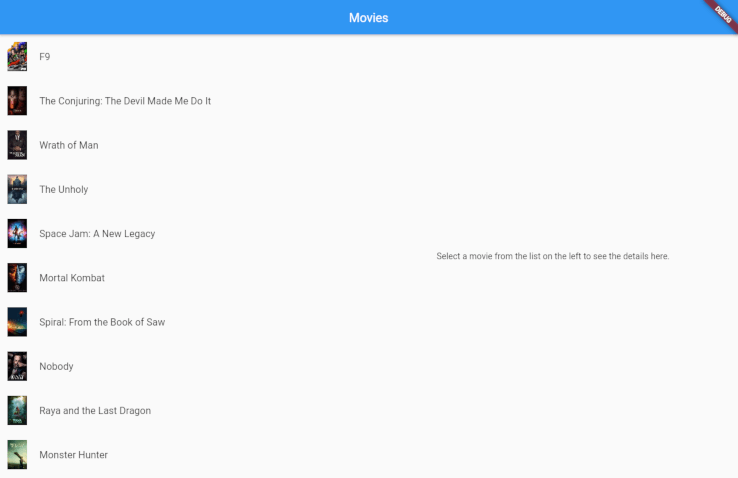
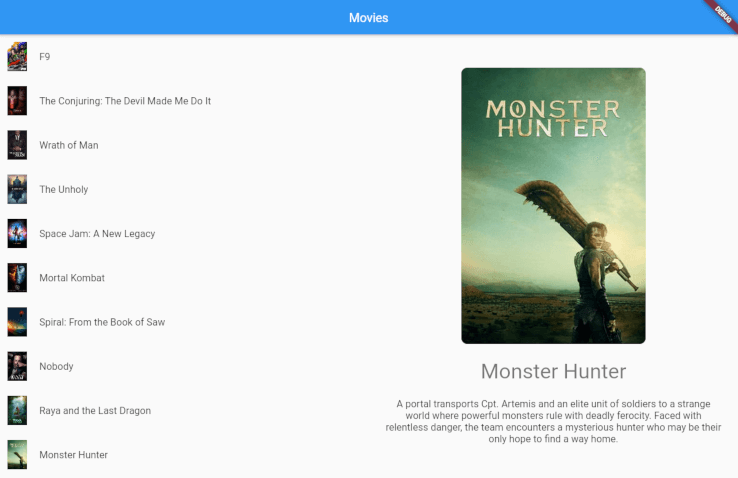

<!-- omit in toc -->
# Flutter Adaptive Layout Tutorial

In this tutorial you'll learn how to easily make a UI layout for your flutter app that adapts to different screen sizes with the [`adaptive_layout`](https://pub.dev/packages/adaptive_layout) package.

The next few sections show how to build a simple UI that displays a list of movie posters and titles and allows the user to see more details of the movie when they tap an item in the list.

<!-- omit in toc -->
## Small screen UI

On small, phone-sized, screens when the user taps an item they will navigate to a different screen with the details.



<!-- omit in toc -->
## Large screen UI

On large screens, when the user taps a list item the details are displayed on the right side of the list and there is no navigation.



<!-- omit in toc -->
## Live demo
Even better than an image, [see a live demo of what we'll be building](https://flutter-adaptive-layout-tutorial.surge.sh/).

<!-- omit in toc -->
## Let's go!
We'll take care of the behavior expected for small screens first, then adapt our implementation for larger screens. These are the steps:

- [1. Create a new app](#1-create-a-new-app)
- [2. Provide the data set](#2-provide-the-data-set)
- [3. Create the model](#3-create-the-model)
- [4. Create the movie list page](#4-create-the-movie-list-page)
- [5. Create the movie detail page](#5-create-the-movie-detail-page)
- [6. Navigate to the detail screen when an item is tapped](#6-navigate-to-the-detail-screen-when-an-item-is-tapped)
- [7. Convert movie list page into home page](#7-convert-movie-list-page-into-home-page)
- [8. Make the home page adaptive with the `adaptive_layout` package](#8-make-the-home-page-adaptive-with-the-adaptive_layout-package)
- [9. Display the detail view when an item is tapped on large screens](#9-display-the-detail-view-when-an-item-is-tapped-on-large-screens)
- [BONUS: Make it look a little better on large screens](#bonus-make-it-look-a-little-better-on-large-screens)
- [BONUS: Tests](#bonus-tests)

## 1. Create a new app

Go ahead and `create` a new flutter app.

```
flutter create adaptive_layout_example
```

## 2. Provide the data set
We'll be using a hard-coded data set, so we can focus our efforts on the UI layout.

1. Under the `lib` folder, create a folder called `data` with a file named `data.dart`.
2. Copy the contents of [lib/data/data.dart](./lib/data/data.dart) into this file.

[See the changes](https://github.com/toureholder/flutter_adaptive_layout_tutorial/commit/f5e4e5592276aeaa7547f722d06187120f7809d3)


## 3. Create the model
Create a `Movie` class with a static function that parses the data into a list of `Movie`s and returns the list.

1. Under the `lib` folder, create a folder called `model` with a file `movie.dart`.
2. Paste the following content into the file.

```dart
import '../data/data.dart';

class Movie {
  final int id;
  final String title;
  final String overview;
  final String posterPath;

  Movie({
    required this.id,
    required this.title,
    required this.overview,
    required this.posterPath,
  });

  static List<Movie> getList() => data
      .map(
        (element) => Movie(
          id: element['id'],
          title: element['title'],
          overview: element['overview'],
          posterPath: element['poster_path'],
        ),
      )
      .toList();
}

const String LARGE_POSTER_BASE_URL = "https://image.tmdb.org/t/p/w300";
const String SMALL_POSTER_BASE_URL = "https://image.tmdb.org/t/p/w92";
```

[See the changes](https://github.com/toureholder/flutter_adaptive_layout_tutorial/commit/96096fe65ed390e4e3c7bd979f7c2e890da95ec2)

## 4. Create the movie list page

Now let's create a page that will display the list of movies:

1. Create a new folder under `lib` called `pages`. 
2. Within the `pages` folder create a file named `movie_list_page.dart`.
3. In `movie_list_page.dart` create two `StatelessWidget`s: one called `MovieListPage` and another called `MovieListView`, with this content.


```dart
class MovieListPage extends StatelessWidget {
  const MovieListPage({Key? key}) : super(key: key);

  @override
  Widget build(BuildContext context) {
    final movies = Movie.getList();

    return Scaffold(
      appBar: AppBar(
        title: Text('Movies'),
      ),
      body: MovieListView(
        movies: movies,
        onTapItem: (Movie movie) {
          // TODO: Navigate to detail screen
        },
      ),
    );
  }
}

class MovieListView extends StatelessWidget {
  final List<Movie> movies;
  final Function(Movie) onTapItem;

  const MovieListView({
    Key? key,
    required this.movies,
    required this.onTapItem,
  }) : super(key: key);

  @override
  Widget build(BuildContext context) {
    return ListView.builder(
      itemCount: movies.length,
      itemBuilder: (context, index) {
        final movie = movies[index];
        return ListTile(
          key: Key('list_item_$index'),
          leading: Image.network(SMALL_POSTER_BASE_URL + movie.posterPath),
          title: Text('${movie.title}'),
          contentPadding: EdgeInsets.all(12.0),
          onTap: () {
            onTapItem.call(movie);
          },
        );
      },
    );
  }
}
```

Observe that `MovieListPage` is a container widget for the presentational `MovieListView` widget.

Now, remove the framework generated `MyHomePage` and `_MyHomePageState` classes from `lib/main.dart` and use `MovieListPage()` as the `home` widget for the `MaterialApp`. The `lib/main.dart` file should now look like this:

```dart
void main() {
  runApp(MyApp());
}

class MyApp extends StatelessWidget {
  @override
  Widget build(BuildContext context) {
    return MaterialApp(
      title: 'Adaptive Layout Tutorial',
      theme: ThemeData(
        primarySwatch: Colors.blue,
      ),
      // Use `MovieListPage()` as the `home` widget
      home: MovieListPage(),
    );
  }
}
```
The list page should now be displayed when the app starts:



[See the changes](https://github.com/toureholder/flutter_adaptive_layout_tutorial/commit/8e87521759a3f383cd175265cb4cfa9f147d9788)


## 5. Create the movie detail page

Now let's create a page that will display more details of a given movie:

1. Within the `pages` folder create a file named `movie_detail_page.dart`.
2. Similarly, in `movie_detail_page.dart` create two `StatelessWidget`s: a container widget called `MovieDetailPage` and a presentational `MovieDetailView` widget, with this content:

```dart
class MovieDetailPage extends StatelessWidget {
  final Movie movie;

  const MovieDetailPage(
    this.movie, {
    Key? key,
  }) : super(key: key);

  @override
  Widget build(BuildContext context) {
    return Scaffold(
      appBar: AppBar(),
      body: MovieDetailView(movie),
    );
  }
}

class MovieDetailView extends StatelessWidget {
  final Movie movie;

  const MovieDetailView(
    this.movie, {
    Key? key,
  }) : super(key: key);

  @override
  Widget build(BuildContext context) {
    return SingleChildScrollView(
      padding: EdgeInsets.all(24.0),
      child: Column(
        crossAxisAlignment: CrossAxisAlignment.center,
        children: [
          ClipRRect(
            borderRadius: BorderRadius.circular(10.0),
            child: Image.network(LARGE_POSTER_BASE_URL + movie.posterPath),
          ),
          SizedBox(height: 24.0),
          Text(
            movie.title,
            style: Theme.of(context).textTheme.headline4,
            textAlign: TextAlign.center,
          ),
          SizedBox(height: 24.0),
          Text(
            movie.overview,
            style: Theme.of(context).textTheme.subtitle1,
            textAlign: TextAlign.center,
          ),
        ],
      ),
    );
  }
}
```

For simplicity, we are just displaying the poster image, title and overview of the movie in the detail view.

[See the changes](https://github.com/toureholder/flutter_adaptive_layout_tutorial/commit/e05d2e71c7fee7b0ddbfa2aeac13e536395b7b59)

## 6. Navigate to the detail screen when an item is tapped
Update the `onTapItem()` callback of the `MovieListView` in the `MovieListPage` widget, so we can navigate to the detail screen and back.

```dart
// Within the `MovieListPage` widget
onTapItem: (Movie movie) {
  Navigator.push(
    context,
    MaterialPageRoute(builder: (context) => MovieDetailPage(movie)),
  );
},
```

With that, our small screen UI is done! You should now be able to navigate to the detail screen and back:


[See the changes](https://github.com/toureholder/flutter_adaptive_layout_tutorial/commit/427abcb49341d9276fe34506cb842067a501e5e4)

## 7. Convert movie list page into home page
As a first step to making our layout adaptive to different screen sizes:

1. Convert `MovieListPage` to a `StatefulWidget`. (In VS Code place the cursor on `StatelessWidget`, press CTRL/CMD + . and select "Convert to StatefulWidget".)
2. For semantic's sake rename it to `HomePage` and the file to `home_page.dart`. 

On small screens the `HomePage` widget will contain only the `MovieListView`. On large screens the `HomePage` widget will contain the `MovieListView` and the `MovieDetailView` side by side. You'll understand why we converted the widget to a `StatefulWidget` in just a bit.

[See the changes](https://github.com/toureholder/flutter_adaptive_layout_tutorial/commit/a1b006b874539150b5ca681f58f1c0f023030290)


## 8. Make the home page adaptive with the `adaptive_layout` package
To help us implement us display different layouts on different screen sizes we'll use the [`adaptive_layout`](https://pub.dev/packages/adaptive_layout) package.

1. Install it with
```bash
$ flutter pub add adaptive_layout
```

This will add a line like this to your package's pubspec.yaml (and run an implicit dart pub get).

```yaml
dependencies:
  adaptive_layout: ^0.1.3
```

2. Now in `home_page.dart`, import the package:

```dart
import 'package:adaptive_layout/adaptive_layout.dart';
```

3. Update the `body` of the `Scaffold` of `HomePage` to be an `AdaptiveLayout` with a `smallLayout` and a `largeLayout` like so:

```dart
class HomePage extends StatefulWidget {
  const HomePage({Key? key}) : super(key: key);

  @override
  _HomePageState createState() => _HomePageState();
}

class _HomePageState extends State<HomePage> {
  @override
  Widget build(BuildContext context) {
    final movies = Movie.getList();

    return Scaffold(
      appBar: AppBar(
        title: Text('Movies'),
      ),
      // Now using an `AdaptiveLayout` as the `body`
      body: AdaptiveLayout(
        // Provide `MovieListView` as the `smallLayout`
        smallLayout: MovieListView(
          movies: movies,
          onTapItem: (Movie movie) {
            Navigator.push(
              context,
              MaterialPageRoute(builder: (context) => MovieDetailPage(movie)),
            );
          },
        ),
        // Provide a `Row` as the `largeLayout`
        largeLayout: Row(
          children: [
            Expanded(
              child: MovieListView(
                movies: movies,
                onTapItem: (Movie movie) {
                  // TODO: Update detail view to the right
                },
              ),
            ),
            Expanded(
              child: Container(
                child: Center(
                  child: Text(
                    'Select a movie from the list on the left to see the details here.',
                  ),
                ),
              ),
            )
          ],
        ),
      ),
    );
  }
}
```

The `smallLayout` is just our `MovieListView` and the `largeLayout` is a 2-column `Row` with the `MovieListView` in the first `Expanded` column.

At this point, on small screens the app should have the same behavior as before of navigating to the detail page when a list item is tapped. On large screens we should now see the list on the left-hand side of the screen and the message "Select a movie from the list on the left to see the details here" in the center of the right-hand side of the screen: 



However, nothing happens when we tap a list item on large screens. Let's tackle that next.

## 9. Display the detail view when an item is tapped on large screens
With a few new lines of code in the `home_page.dart` file we can display the detail view on the right hand side when an item is tapped on large screens.

1. Create a private property of the `_HomePageState` of type `Movie?` named `_selectedMovie`.
```dart
class _HomePageState extends State<HomePage> {
  Movie? _selectedMovie;

  ...
```

2. Update the `onTapItem()` callback of the `MovieListView` in the **`largeLayout`** of the `AdaptiveLayout` widget to update the `_selectedMovie` property with `setState`. This is why we converted the widget to a `StatefulWidget` a few steps ago.

```dart
// Within the `largeLayout`
onTapItem: (Movie movie) {
  setState(() {
    _selectedMovie = movie;
  });
},
```

3. Update the second `Expandable` of the `Row` to display the message if `_selectedMovie` is `null` and the `MovieDetailView` otherwise.
```dart
Expanded(
  child: Container(
    child: _selectedMovie == null
        ? Center(
            child: Text(
              'Select a movie from the list on the left to see the details here.',
            ),
          )
        : MovieDetailView(
            _selectedMovie!,
          ),
  ),
)
```

And... we're done! 🎉

On small, phone-sized, screens when the user taps an item they will navigate to a different screen with the details and on larger screens the details are displayed on the right side of the list and there is no navigation.



[See the changes](https://github.com/toureholder/flutter_adaptive_layout_tutorial/commit/5df19896e44c182059598f886bf55660bae37ae5)

---

## BONUS: Make it look a little better on large screens
To make our app look a little better, let's leave the selected list item highlighted and put a divider line between the list view and the detail view with a few new lines of code in the `home_page.dart` file.

1. Add a new attribute `selectedId` attribute to `MovieListView`, so it knows which item a selected.
```dart
class MovieListView extends StatelessWidget {
  final List<Movie> movies;
  final Function(Movie) onTapItem;
  final int? selectedId;

  const MovieListView({
    Key? key,
    required this.movies,
    required this.onTapItem,
    this.selectedId,
  }) : super(key: key);

  ...
```

2. Update the `itemBuilder` of the `ListView.builder` to wrap the `ListTile` in a `Container` and give the `Container` color if the `ListTile`'s movie is the selected one.
```dart
itemBuilder: (context, index) {
  final movie = movies[index];

  final color = movie.id == selectedId
      ? Theme.of(context).primaryColor.withOpacity(0.25)
      : Colors.transparent;

  return Container(
    color: color,
    child: ListTile(
      key: Key('list_item_$index'),
      leading: Image.network(SMALL_POSTER_BASE_URL + movie.posterPath),
      title: Text('${movie.title}'),
      contentPadding: EdgeInsets.all(12.0),
      onTap: () {
        onTapItem.call(movie);
      },
    ),
  );
},
```

3. Update the first `Expandable` of the `Row` in the `largeLayout` of the `AdaptiveLayout` to provide the selected movie's `id` to the `MovieListView`.
```dart
Expanded(
  child: MovieListView(
    movies: movies,
    onTapItem: (Movie movie) {
      setState(() {
        _selectedMovie = movie;
      });
    },
    selectedId: _selectedMovie?.id,
  ),
),
```

4. Lastly, let's add a border to the left-hand side of the detail view's `Container` with some `BoxDecoration`.
```dart
Expanded(
  child: Container(
    decoration: BoxDecoration(
      border: Border(
        left: BorderSide(
          color: Colors.grey[300]!,
          width: 1.0,
        ),
      ),
    ),
    child: _selectedMovie == null
        ? Center(
            child: Text(
              'Select a movie from the list on the left to see the details here.',
            ),
          )
        : MovieDetailView(
            _selectedMovie!,
          ),
  ),
)
```
 
 Of course the sky's the limit with the design, but I think our app is minimally presentable now:

 

[See the changes](https://github.com/toureholder/flutter_adaptive_layout_tutorial/commit/270ee50594899df6456cdf0440257d117bc043ab)

## BONUS: Tests
I chose not to TDD this so we could focus on the layout, but you can find [the tests](test/) here in the source code.

Note in the tests that I use `WidgetTester` to specify a small screen size in a `setUp` function like this:

```dart
setUp(() {
  binding.window.physicalSizeTestValue = Size(
    AdaptiveLayout.getBreakpoints().mediumScreenMinWidth - 10,
    500,
  );

  binding.window.devicePixelRatioTestValue = 1.0;
});
```

and to specify a large screen size like this:

```dart
setUp(() {
  binding.window.physicalSizeTestValue = Size(
    AdaptiveLayout.getBreakpoints().largeScreenMinWidth + 10,
    500,
  );

  binding.window.devicePixelRatioTestValue = 1.0;
});
```

In this repo you'll can see the complete source code with a separate commit for each step 😉.

Congrats on making it to the end and thanks for following along! 👏 ❤️ ⭐ 🦄 🔖
